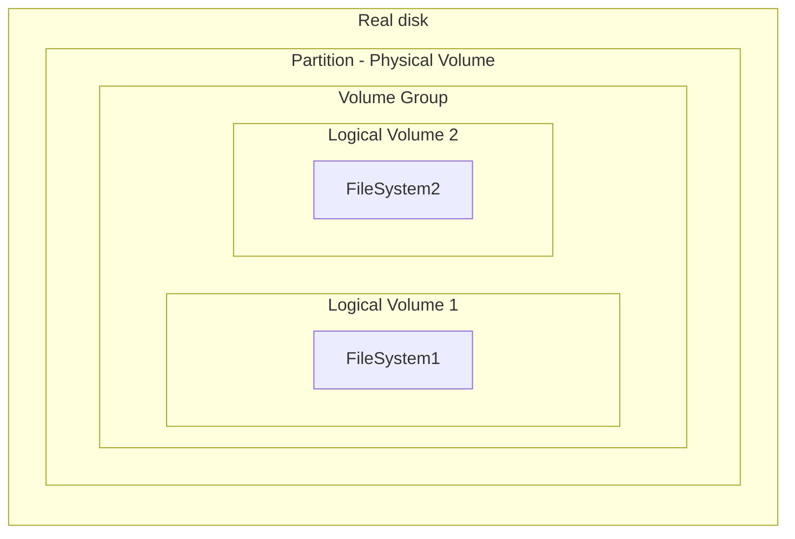

How to install a new server from scratch? OS, partitioning, middleware packages\
Here is the case with a Debian OS installed on an HPE server where we want to install KVM and Docker bare metal.\
The server is disconnected from internet and is brand new.


## Create a bootable USB drive with Debian

Insert an USB drive with sufficient free storage on a Debian host.
Enter the command line `fdisk -l` to know the name of the USB drive (e.g. /dev/sdb)

{: .warning }
> Be sure of the disk name, the following steps will erase all data for this disk.


Unmount the USB drive: umount /dev/sdb
Adapt the name of your USB drive.

Download the Debian iso file:\
`wget -O "debian.iso" "https://url_to_get_debian/debian-xxx.iso"`

Write the image on the USB drive:\
`dd if=debian.iso of=/dev/sdb bs=4M status=progress && sync`\
Adapt the name of your USB drive.
It can take some time.

Verify with `fdisk -l` that the USB drive is bootable.


## RAID hardware configuration
The RAID will instruct how the system will use the disk:

**RAID 0**: stripping (not good for production system, one disk failure and the data is lost)\
**RAID 1**: mirroring (can tolerate one disk failure, but divide the space by two)\
**RAID 5**: block-level stripping with distributed parity (needs 5 disks, can handle up to 1 disk failure, capacity reduced by 1 disk used for parity)


Plug the server to a power source and plug a screen and keyboard to it.
For HPE servers, do not use the iLO USB port for the keyboard.

Start the server.

On the stating sreen, press F9 when the access choices are displayed.\
Select System Configuration\
Select `Embadded RAID1` puis `Array Configuration`\
Select `Manage Arrays` to check if a RAID is not already configured.\
Select `Create Array`

Create a RAID 1 logical disk with disk 1 and 2 (for the system).
-	Select Bay1 and Bay2
-	Proceed to next form
-	RAID1
-	Keep default settings
-	Submit
-	Back to Main Menu

Create a RAID 0 logical disk for the rest of the disks (applications).\
Same steps and chosing the disk 3,4,5,6 and RAID0.

The disk LED should to be turned on and indicate that the RAID is configured.\
There is an additional icon on the RAID0 disks to avoid taking off the disk (the disk is not redondant).

## Server first start

Start the server and verify the technical information displayed at boot time: CPU, memory installed...\
On the boot screen, the server is trying to find a bootable device on the network.\
Plug the USB drive in and wait until the server is booting on it.

## Debian installation

Select "Graphical install"\
Select the right language and keyboard layout\
Select the network interface to use, as the network is not configured yet, the next steps will fail\
Let the network connection and DHCP attempts fail\
Select: "Do not configure the network now"\
System name: enter the hostname\
superadmin root password: your_password\
(it is a local user to fix the server if needed)\
Create a first user with a name, lastname, password\
Disk configuration: Guided - use an entire disk\
Select the first disk (0.0.0) 480Go\
Select all in one partitiion: we will get an automated split with 200Go of SWAP and the rest of the system. \
Apply the changes for the disks: YES\
The system installation is starting.\
"Continue without network mirror?": YES\
"Do you want to participate in the survey": NO\
Software to install: usual system utilities\
Installation ends: unplug the USB drive to avoid booting on it at the next restart (as shown in the installation guide). \
The server is rebooting after clicking on continue.


## First boot on OS

Use the superadmin user and password to connect.

### Network configuration

We can verify the network interfaces with the command `ip a`:

```
1: lo: <LOOPBACK,UP,LOWER_UP> mtu 65536 qdisc noqueue state UNKNOWN group default qlen 1000
    link/loopback 00:00:00:00:00:00 brd 00:00:00:00:00:00
    inet 127.0.0.1/8 scope host lo
       valid_lft forever preferred_lft forever
    inet6 ::1/128 scope host
       valid_lft forever preferred_lft forever
2: eno5np0: <BROADCAST,MULTICAST,UP,LOWER_UP> mtu 1500 qdisc mq state UP group default qlen 1000
    link/ether f4:04:43:c5:e1:09 brd ff:ff:ff:ff:ff:ff
3: eno6np1: <BROADCAST,MULTICAST> mtu 1500 qdisc noop state DOWN group default qlen 1000
    link/ether f4:04:43:c5:e1:08 brd ff:ff:ff:ff:ff:ff
```

Example of a network interface.\
We see 2 interfaces: eno5np0 and eno6np1.

We can configure eno5np0 for instance, edit /etc/network/interfaces with nano:

```
# This file describes the network interfaces available on your system
# and how to activate them. For more information, see interfaces(5).

source /etc/network/interfaces.d/*

# The loopback network interface
auto lo
iface lo inet loopback
allow-hotplug eno5np0
iface eno5np0 inet static
        address 192.168.1.3
        netmask 255.255.255.0
        network 199.168.1.0
        broadcast 192.168.1.255
        gateway 192.168.1.10

```
Example of a network interface configuration. We are giving a fix ip 192.168.1.3 to the interface eno5np0.\
We can plug the server to the network.\
Reboot the server and change again the network configuration with `ip a`.

### Install ssh server

For now, the server has ssh client (able to connect to other servers), but not ssh server (for others to connect to it).

Get the debian packages from an other reachable server and copy the files we need:

```
scp –r adrien@192.168.1.10:/home/adrien/libwrap* /home/adrien/
scp –r adrien@192.168.1.10:/home/adrien/openssh-* /home/adrien/
```

Install the packages in the right order:

```
dpkg -i openssh-sftp-server_xxx_amd64.deb
dpkg -i libwrap0_xxx_amd64.deb
dpkg -i openssh-server_xxx_amd64.deb

```

Add root rights for the first user created: 
```
adduser adrien
usermod -aG sudo adrien
```

We can now reach the server from the network and become root with the user we created (su - root).\
We don't need to be physically on the server to access it.

## Linux repositories configuration

Configure the Debian repositories. The configuration is set on the file `/etc/apt/sources.list`\
Set the repositories URL.

If the server can't resolve it, we can help it by adding ip resolutions in /etc/hosts:
```
192.168.1.11     my_remote_debian_repo_hostname
```

We can ping the host to see if we can reach it.

If the ping is working, we can update the packages:
```bash
apt update
apt upgrade
```

## Install useful packages

We can now install some useful packages using the Debian repository:
```
apt install vim
apt install wget
```

## Create local users

We can add other local users if needed and add them to the sudo group:
```
adduser user01
adduser user02
adduser user03
usermod -aG sudo user01
usermod -aG sudo user02
usermod -aG sudo user03
```

Add the ssh keys to be able to connect via ssh with these users.\
The ssh keys are stored in `/home/user_name/.ssh/authorized_keys`

Install sudo to be able to escalate privilages without switching the the root user:
```
apt-get install sudo -y
```

## DNS configuration

Install the package for DNS resolutions:
```
apt install resolvconf 
```

The DNS configuration is in the file `/etc/resolv.conf`:
```
domain my_dns_server_hostname
search my_dns_server_hostname
nameserver 192.168.1.12
```

We can add the dns configuration in the network interface too:

```
iface lo inet loopback
allow-hotplug eno5np0
iface eno5np0 inet static
        address 192.168.1.3
        netmask 255.255.255.0
        network 199.168.1.0
        broadcast 192.168.1.255
        gateway 192.168.1.10
        dns-nameservers 192.168.1.12
        dns-search my_dns_server_hostname
        dns-domain my_dns_server_hostname
```

Remove all lignes in /etc/hosts for static resolution, the DNS will now resolve it by itself.

Reboot to have the network interface configuration updated.

## Docker installation

Add your Debian repository for Docker in `/etc/apt/sources.list.d/docker.list`

Add a key if needed for the repository:
```
sudo apt install gnupg2
wget --quiet -O - http://192.168.1.13/docker.gpg | sudo apt-key add -
```

Update the repositories and install docker-ce:
```
apt update
apt install docker-ce
```

### Create a new partition for Docker

Install the utility for partitions:
```
apt install lvm2
```

List the disks:
```
fdisk -l
```

Take one of the empty disks in the list (e.g. /dev/sdb).

{: .warning }
> Don't take the disk on which the system is installed

Add a new disk:
```
fdisk /dev/sdb (add the new disk)
	Enter n and Enter 5 times
	Enter t 
	Enter 8e
	Enter w
```

Create a physical volume:
```
pvcreate /dev/sdb1 (creates physical volume)
pvdisplay (check the physical volumes)
```

Create a volume group :
```
vgcreate vgdocker /dev/sdb1
vgdisplay (check the volume groups)
```

Create a logical volume (900Go or 50% of 1.8To) :
```
lvcreate -l 50%VG -n lvdocker vgdocker
lvdisplay (check the logical volumes)
```

Format the volume (can take some time, wait until the command ends):
```
mkfs.ext4 /dev/mapper/vgdocker-lvdocker
```

Add the new volume on the fstab to map it with the existing docker installation directory.\
In `/etc/fstab`, add at the end:
```
/dev/mapper/vgdocker-lvdocker        /var/lib/docker         ext4    defaults        0       2
```

Mount the volume:
```
mount /dev/mapper/vgdocker-lvdocker
```

Verify that `/var/lib/docker` is on the right volume (900Go) with `df –h` and `lsblk` :
```
NAME                     MAJ:MIN RM   SIZE RO TYPE MOUNTPOINT
sda                        8:0    0 447,1G  0 disk
├─sda1                     8:1    0   512M  0 part /boot/efi
├─sda2                     8:2    0   255G  0 part /
└─sda3                     8:3    0 191,7G  0 part [SWAP]
sdb                        8:16   0   1,8T  0 disk
└─sdb1                     8:17   0   1,8T  0 part
  ├─vgdocker-lvdocker    254:0    0 894,2G  0 lvm  /var/lib/docker

```

Restart docker after partition configuration:
```
service docker restart
```



### Docker configuration

Edit the file `/lib/systemd/system/docker.service`:
```
ExecStart=/usr/bin/dockerd -H fd:// -H tcp://192.168.1.10:4243 --containerd=/run/containerd/containerd.sock
```
We can setup the port we want here for docker.

Reload the service to have the changes applied:
```
systemctl reload docker.service
systemctl daemon-reload
service docker status
```

We can increase the inotify limit in `/proc/sys/fs/inotify/max_user_watches`:
```
sysctl fs.inotify.max_user_watches=33768
```
And in `/etc/sysctl.conf`:
```
sysctl fs.inotify.max_user_watches=33768
```


## KVM installation

Install the following packages:
```
apt -y install qemu-kvm libvirt-daemon  bridge-utils virtinst libvirt-daemon-system
```
Add the rights for users :
```
usermod -aG libvirt adrien
```
Verify that the virsh command is working:
```
virsh -version
virsh list
```

## General note on this installation

The installation is specific to a context where the server is not connected to internet and 
needs a configuration to get the packages on a local network.

This installation is creating a 900GB partition for Docker on a 1.8TB disk.
The rest of the disk is not formated and can be used for something else.

KVM is installed on the same partition than the OS here (in RAID1). 
If we create a lot of VM, it can fill up the OS disk.
We can do the same than for docker and create a specific partition for it:
- create a new logical volume
- format it
- add the mapping in `/etc/fstab`
- mount the volume
