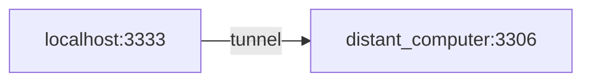
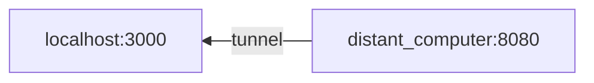

## Local forward

SSH can be used to forward a local port to a distant machine. It is a local forwarding:

`ssh -L 3333:localhost:3306 distant_computer`

With this, if you connect to localhost port 3333, you will be forwarded to the distant_computer port 3306

## Remote forward

SSH can be use to give access for a distant machine to a local port. We can use the remote forwarding for this:

`ssh -R 8080:localhost:3000 distant_computer`

The distant_computer by connecting to its 8080 will be forwarded to my localhost port 3000.

